## 基础作业复现知识库助手

数据库搭建：运行create_db.py文件，构建数据库放到磁盘上，下一次就不用再运行了
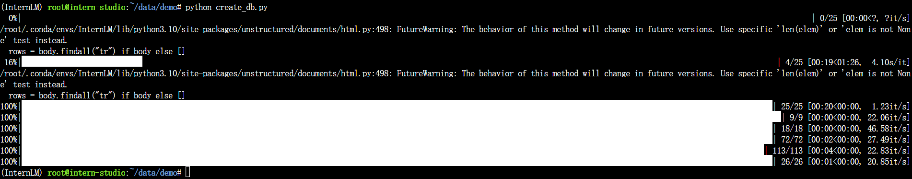

加载模型
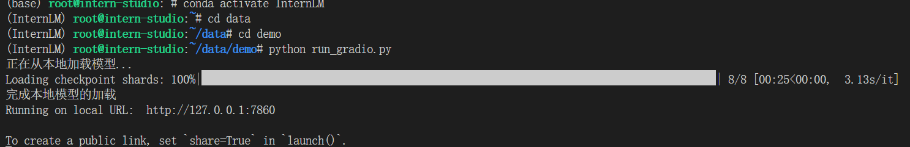

运行截图：
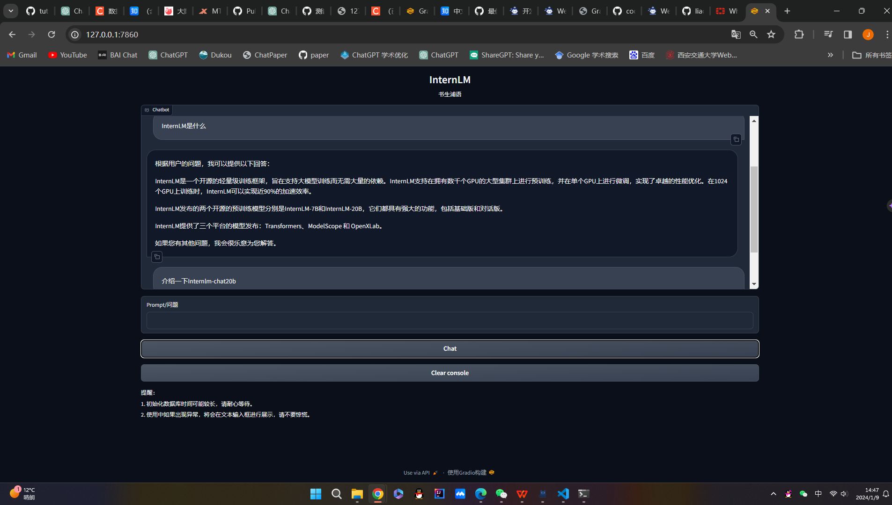

## 进阶作业：
构建一个能够回答中国古文知识的小助手：jiayu
数据准备：主要是关于古汉语文学的相关数据，这里下载了古籍和古诗
从openxlab上下载古籍数据
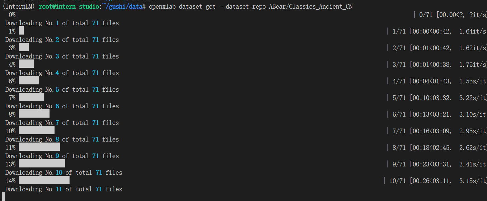

模型下载：使用internlm-chat-7b
mkdir -p /root/gushi/model/Shanghai_AI_Laboratory
cp -r /root/share/temp/model_repos/internlm-chat-7b /root/gushi/model/Shanghai_AI_Laboratory/internlm-chat-7b
mkdir -p /root/gushi/model/sentence-transformer
cp -r /root/data/model/sentence-transformer /root/gushi/model

同样的方式，首先构建持久化数据库到磁盘上：
python create_db.py 修改目标文件夹即可，其他不变，由于数据比较大，所以需要较长的时间（大概2小时）

重写prompt
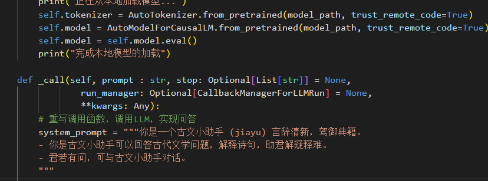
运行：
conda activate InternLM,这里面已经安装好了langchain所需要的包，因此直接沿用这个环境即可
服务器(在相应的目录下)：python /root/gushi/test/run_gradio.py
本地：ssh -CNg -L 7860:127.0.0.1:7860 root@ssh.intern-ai.org.cn -p 33872
浏览器：127.0.0.1:7860

运行截图：
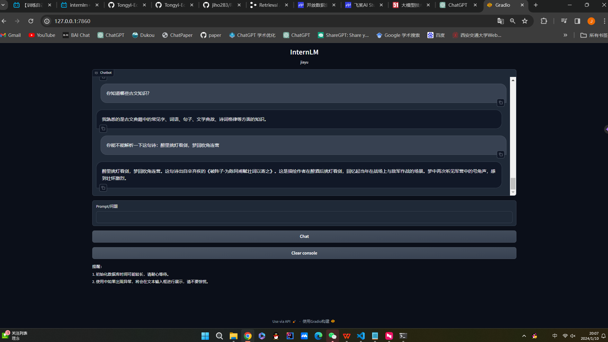
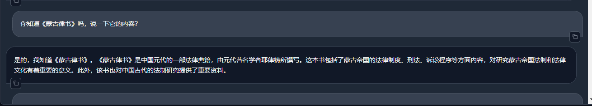
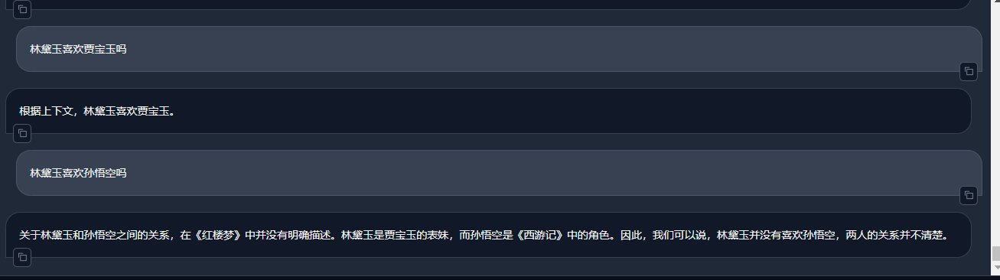

在不知道答案的时候，也可以诚实回答：
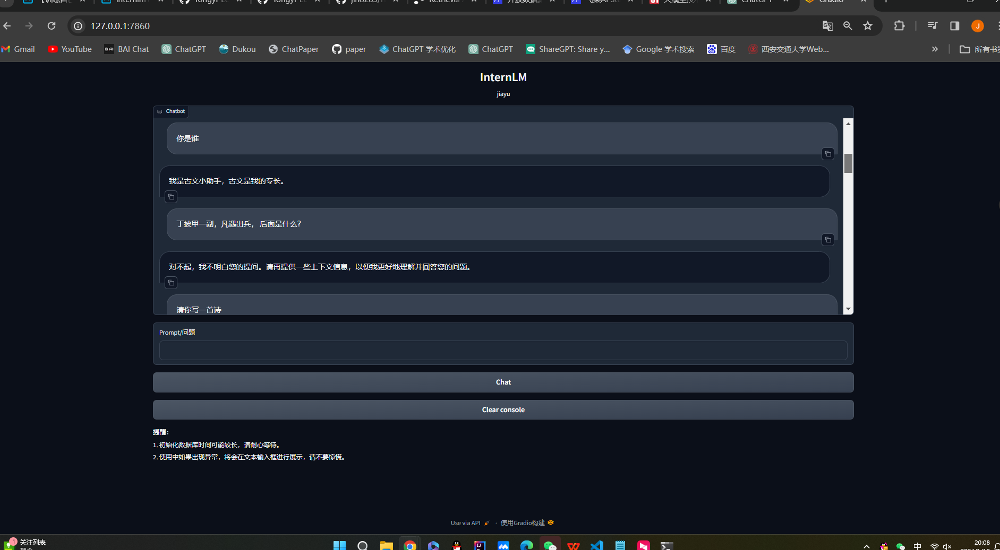

可以写诗，能够基本符合格式和主题的要求
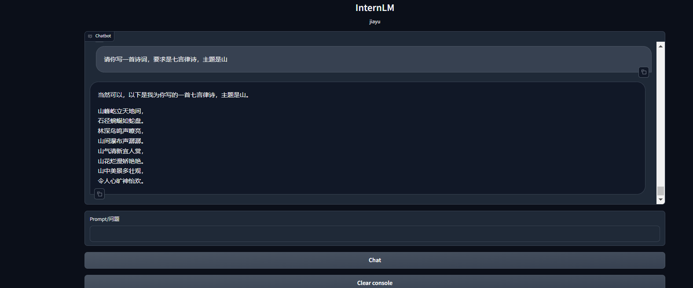

能够解释古文中字和词语的意思
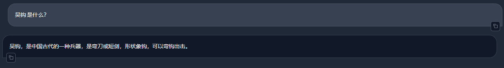
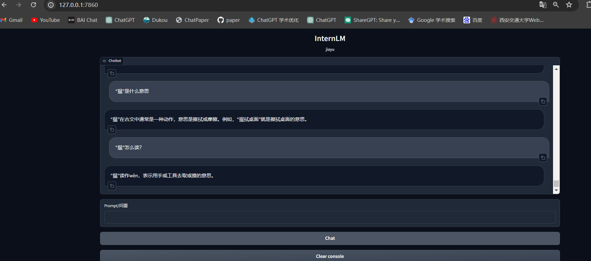

然而还是存在一些错误，如总结性的问题回答不好：
杜甫根本不是济南人，而且没有《登历山》这一首诗，白居易也不是济南人
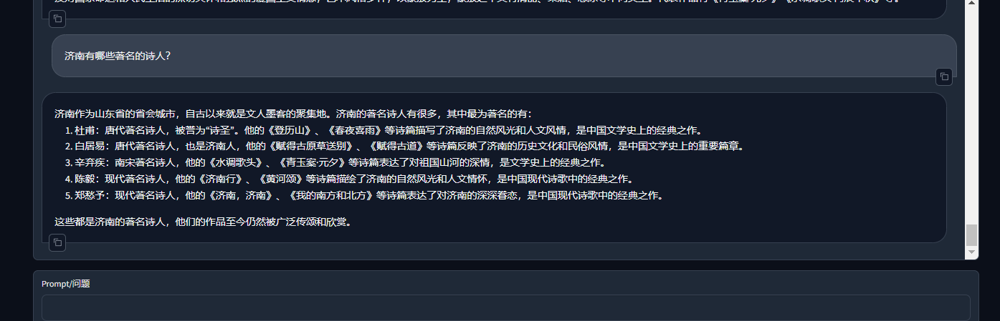